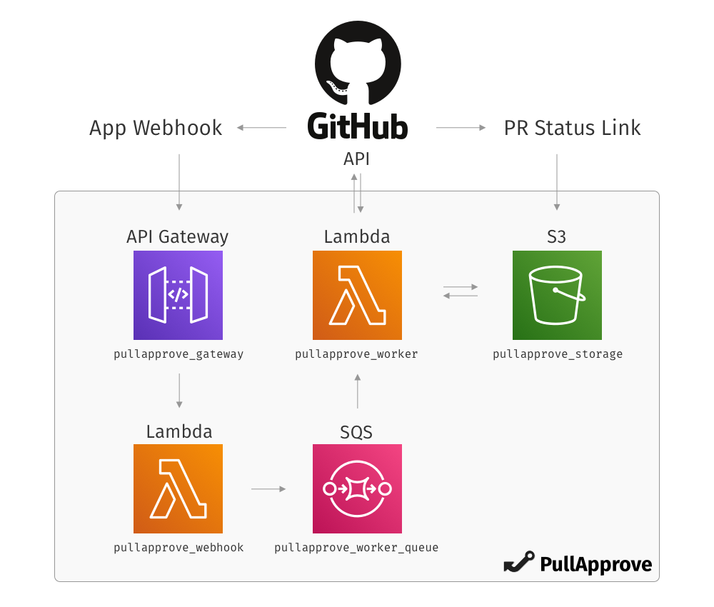

# 

These are the tools and instructions for deploying PullApprove Enterprise into your own AWS account,
to work with your GitHub Enterprise installation.

This is built on [Terraform](https://www.terraform.io),
which you will need to install and familiarize yourself with if you have not used it before.
If you have any questions,
please contact us directly.

## Docs

- [First time installation (GitHub)](docs/install.md)
- [First time installation (GitLab)](docs/install-gitlab.md)
- [Updating to a new version](docs/update.md)
- [FAQs](docs/faqs.md)

## Overview

Below is a basic diagram to give you an idea of how
PullApprove works in AWS and integrates with GitHub.
For more details, look at the Terraform files themselves.

