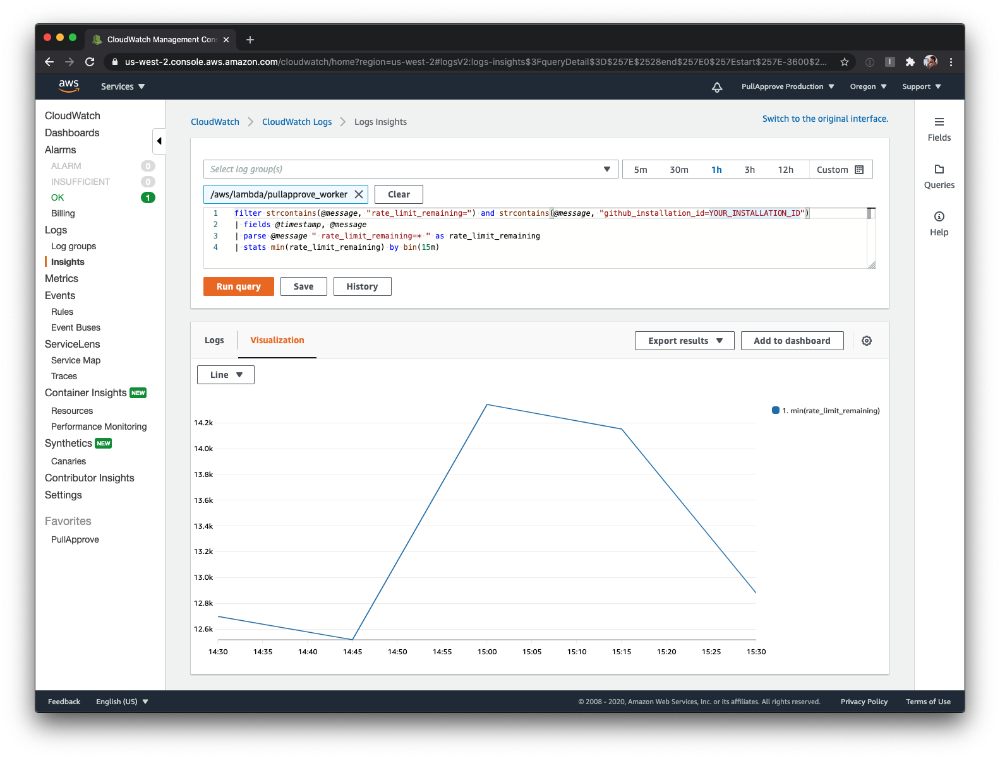
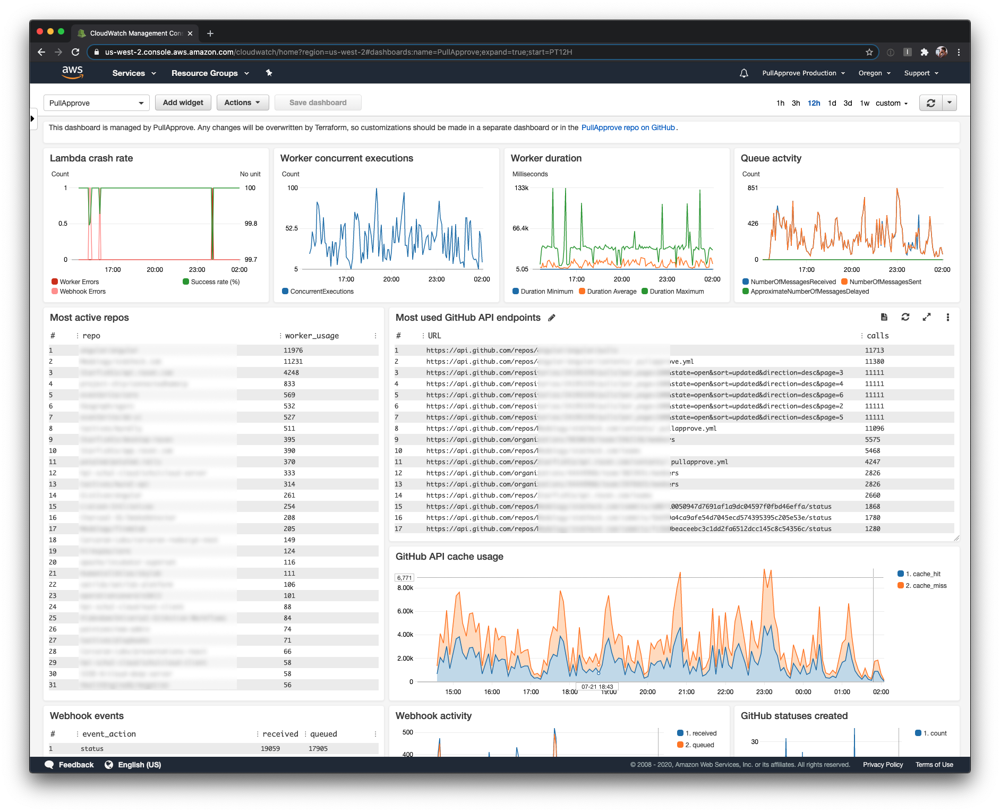

# FAQs

### How do I know which version I have running?

The version number for the various components
(which should all match)
can be found in the following places:

- the bottom right corner of your internal documentation site
- the meta section of the "debug" tab of the PR report viewer
- a `VERSION` env variable on the functions themselves

### How does caching work?

The current caching system is file-based,
and respects the GitHub API cache-control headers.

In AWS Lambda, concurrent functions often [re-use containers](https://aws.amazon.com/blogs/compute/container-reuse-in-lambda/) and will share the cache.

Most GitHub API responses have a `Cache-Control` header containing `s-maxage=60`,
meaning that concurrent requests to that resource are allowed to be stale for a full minute.
So,
it is possible that if you make two quick changes to PR labels,
for example,
you may not see those changes reflected immediately.
This behavior helps decrease the load on your server but also has the risk of using outdated data.

To trigger a PR to be refreshed,
almost any event (like a change in labels) will trigger a new function invocation.
So if you are afraid that the data you are seeing is not up-to-date,
just wait a full minute and trigger a refresh.

If you want to disable caching entirely,
you can set the Terraform variable to an empty string: `cache = ""`

### Is GitHub API rate limiting an issue?

Your GitHub API rate limit depends on a few factors, so the actual limit can vary.
As of version 3.11.0 we log your remaining rate limit so that you can visualize how it's used over time.
Note that the built-in CloudWatch dashboard doesn't show this because you have to specify the GitHub Installation ID
(if you install the app on more than one organization).
We recommend setting up a separate, custom dashboard for monitoring this or other specific things you may want to look at.

An example CloudWatch Insights query:
```sql
filter strcontains(@message, "rate_limit_remaining=") and strcontains(@message, "github_installation_id=YOUR_INSTALLATION_ID")
| fields @timestamp, @message
| parse @message " rate_limit_remaining=* " as rate_limit_remaining
| stats min(rate_limit_remaining) by bin(15m)
```



### The pullapprove status isn't showing up. What do I do?

First, check the CloudWatch dashboard (if you have access to it) and look for anything out of the ordinary.



Then, we suggest checking the following, in this order.

1) Add/remove a label to trigger pullapprove to run. Wait a minute to make sure the status doesn't show up.
2) Is there a .pullapprove.yml version 3 in the repo default branch? The status does not show up if there is no config, or the config is version 2.
3) Is the pullapprove GitHub App installed on the repo? (Do other PRs have pullapprove, check repo/settings/installations)
4) Are the webhooks being received successfully? Can check this in the GitHub App settings "advanced" tab.
5) Are there errors in the worker logs?

### When I click a PR status, the report fails to load

If the browser console is giving a CORS error and your installation is brand new,
it may take a few hours for your new S3 bucket to propagate and for the URL to work as expected.

### How do I transition from a clone of this repo to using it as a Terraform module?

In order to transition the `terraform.tfstate` from a cloned setup to a module setup,
our current recommendation is to manually modify `terraform.tfstate`.
In your editor of choice, find `"mode": "managed",` and replace with `"module": "module.your_module_name", "mode": "managed",`. When you run terraform apply, it should now recognize most of the state as being the same as the current, and only show the few changes you expect.

## Security

### What data is stored?

PullApprove stores JSON documents each time that a new PR status is generated.
This contains information about the configuration used,
the results of any group "condition" statements,
and reviewers (by username) involved at that point in time.
The JSON files are automatically deleted after 60 days (by default).

You can see a simplified example of the JSON here: [pullapprove-status-example.json](pullapprove-status-example.json)

The logs for PullApprove can store GitHub API requests/responses,
depending on your settings and config.
These are automatically deleted after 30 days by default but can change depending on your setup.

Our hosted pullapprove.com SaaS stores a minimal amount of additional user and organization data,
such as OAuth tokens, IDs, names, and references to Stripe subscriptions.

### Is data sent to third-parties?

PullApprove Enterprise only sends data between your GitHub Enterprise instance and AWS resources.
No data is sent back to us or to other providers unless you configure it to do so.

Our hosted pullapprove.com SaaS uses Stripe for billing and subscription data, and Sentry for error tracking.

### Does PullApprove have permission to write to our repos?

No! PullApprove only has read access to your code.

### What should the webhook allowed IP addresses be when using with GitHub.com?

GitHub.com's webhook IP addresses can be found at https://api.github.com/meta.
(A handy command is `curl -s https://api.github.com/meta | jq .hooks`.)
You can copy this list directly to `var.webhook_ip_allowlist`.

### How can I get a static IP to add PullApprove to an allowed IP list?

In order to do this you need to create a VPC, that has a NAT gateway, that is assigned an elastic IP, and connects the public and private subnets (where private is attached to your worker Lambda function).

There are some articles online about how to do this,
but here's an example config that can be added to your repo:

```hcl
resource "aws_vpc" "pullapprove_vpc" {
  cidr_block = "10.0.0.0/16"

  tags = {
    Name = "pullapprove_vpc${var.aws_unique_suffix}"
  }
}

resource "aws_subnet" "pullapprove_subnet_public" {
  vpc_id     = aws_vpc.pullapprove_vpc.id
  cidr_block = "10.0.0.0/24"

  tags = {
    Name = "pullapprove_subnet_public${var.aws_unique_suffix}"
  }
}

resource "aws_internet_gateway" "pullapprove_internet_gateway" {
  vpc_id = aws_vpc.pullapprove_vpc.id

  tags = {
    Name = "pullapprove_internet_gateway${var.aws_unique_suffix}"
  }
}

resource "aws_route_table" "pullapprove_subnet_public_route_table" {
    vpc_id = aws_vpc.pullapprove_vpc.id

    route {
        cidr_block = "0.0.0.0/0"
        gateway_id = aws_internet_gateway.pullapprove_internet_gateway.id
    }

    tags = {
      Name = "pullapprove_subnet_public_route_table${var.aws_unique_suffix}"
    }
}

resource "aws_route_table_association" "pullapprove_subnet_public_route_table_association" {
    route_table_id = aws_route_table.pullapprove_subnet_public_route_table.id
    subnet_id = aws_subnet.pullapprove_subnet_public.id
}


resource "aws_subnet" "pullapprove_subnet_private" {
  vpc_id     = aws_vpc.pullapprove_vpc.id
  cidr_block = "10.0.1.0/24"

  tags = {
    Name = "pullapprove_subnet_private${var.aws_unique_suffix}"
  }
}

resource "aws_eip" "pullapprove_elastic_ip" {
  vpc      = true
  depends_on = [aws_internet_gateway.pullapprove_internet_gateway]
  tags = {
    Name = "pullapprove_elastic_ip${var.aws_unique_suffix}"
  }
}

resource "aws_nat_gateway" "pullapprove_nat_gateway" {
  allocation_id = aws_eip.pullapprove_elastic_ip.id
  subnet_id     = aws_subnet.pullapprove_subnet_public.id
  connectivity_type = "public"

  tags = {
    Name = "pullapprove_nat_gateway${var.aws_unique_suffix}"
  }

  # To ensure proper ordering, it is recommended to add an explicit dependency
  # on the Internet Gateway for the VPC.
  depends_on = [aws_internet_gateway.pullapprove_internet_gateway]
}

resource "aws_route_table" "pullapprove_subnet_private_route_table" {
    vpc_id = aws_vpc.pullapprove_vpc.id

    route {
        cidr_block = "0.0.0.0/0"
        nat_gateway_id = aws_nat_gateway.pullapprove_nat_gateway.id
    }

    tags = {
      Name = "pullapprove_subnet_private_route_table${var.aws_unique_suffix}"
    }
}

resource "aws_route_table_association" "pullapprove_subnet_private_route_table_association" {
    route_table_id = aws_route_table.pullapprove_subnet_private_route_table.id
    subnet_id = aws_subnet.pullapprove_subnet_private.id
}

resource "aws_security_group" "pullapprove_worker_security_group" {
  name        = "pullapprove_worker_security_group${var.aws_unique_suffix}"
  description = "Allow outbound traffic"
  vpc_id      = aws_vpc.pullapprove_vpc.id

  egress {
    from_port        = 0
    to_port          = 0
    protocol         = "-1"
    cidr_blocks      = ["0.0.0.0/0"]
  }

  tags = {
    Name = "pullapprove_worker_security_group${var.aws_unique_suffix}"
  }
}


resource "aws_iam_policy" "pullapprove_lambda_ip_policy" {
  name        = "pullapprove_lambda_ip${var.aws_unique_suffix}"
  path        = "/"
  description = "IAM policy for getting a static IP for the worker Lambda"

  policy = <<EOF
{
  "Version": "2012-10-17",
  "Statement": [
    {
      "Action": [
        "ec2:CreateNetworkInterface",
        "ec2:DescribeNetworkInterfaces",
        "ec2:DeleteNetworkInterface"
      ],
      "Effect": "Allow",
      "Resource": "*"
    }
  ]
}
EOF
}

resource "aws_iam_role_policy_attachment" "pullapprove_lambda_ip_attachment" {
  role       = aws_iam_role.pullapprove_lambda_role.name
  policy_arn = aws_iam_policy.pullapprove_lambda_ip_policy.arn
}

output "pullapprove_public_ip" {
  value = aws_eip.pullapprove_elastic_ip.public_ip
  description = "Public IP that can be used for allow-listing API access for PullApprove."
}
```

Then in the existing `worker.tf`, you can update the `vpc_config`:

```hcl
resource "aws_lambda_function" "pullapprove_worker" {
  ...

  # Update vpc_config to use the new subnet and security group
  vpc_config = {
    subnet_ids = [
      aws_subnet.pullapprove_subnet_private.id,
    ]
    security_group_ids = [
      aws_security_group.pullapprove_worker_security_group.id,
    ]
  }
}
