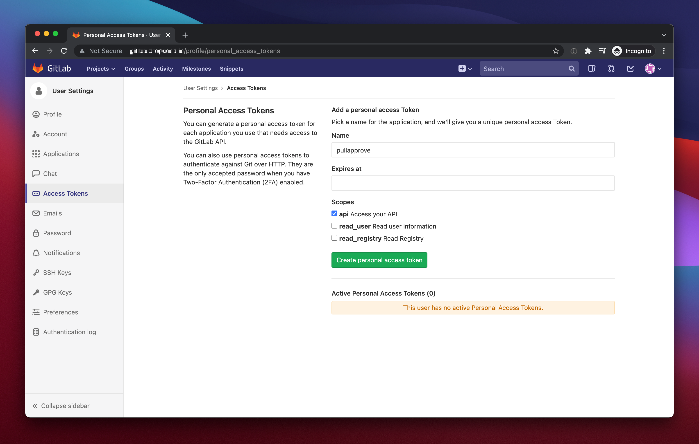
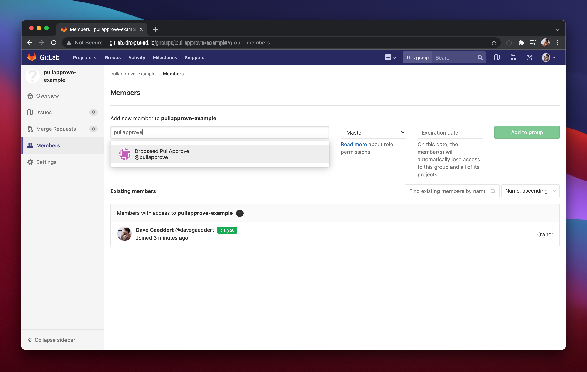
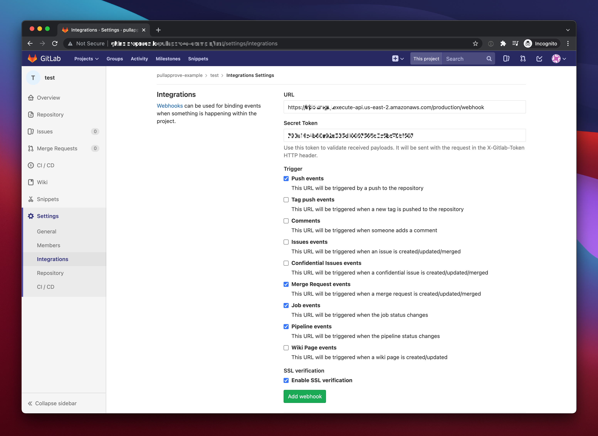

# Installing PullApprove for GitLab

Make sure you have the following things installed or set up and ready to go.

- git
- an AWS account
- [Terraform](https://www.terraform.io/downloads.html)
- GitLab 13.9+ (if self-hosted)

## Clone this repo

You will want to maintain a clone/fork of this repo to streamline the process updating to new versions.

```sh
$ git clone https://github.com/dropseed/pullapprove-enterprise pullapprove-yourcompany
$ cd pullapprove-yourcompany
$ git remote rename origin upstream
# Create a new, private and empty git repo that you can push this to
$ git remote add origin <your repo url>
$ git push --set-upstream origin
```

## Create a "pullapprove" GitLab user

PullApprove will integrate through a user account that you create and give access to specific groups or repos.
You could use a personal account for initial testing,
but ultimately you will want a separate account with its own rate limit and permissions.

On GitLab.com you will need to use something other than "pullapprove" (ex. "pullapprove-yourcompany").

## Create a personal access token

While logged in as your "pullapprove" user,
create a new personal access token with the "api" scope.
Save the token or leave the window open so you can use it as a Terraform variable.



## Set up Terraform variables and provider

There are a handful of required and optional settings.
The full list of settings can be found in [variables.tf](../aws/variables.tf).
An easy way to configure your settings is to create `aws/terraform.tfvars` that looks like this:

```hcl
aws_region = "(an AWS region)"
aws_access_key = "(an AWS access key)"
aws_secret_key = "(an AWS secret key)"
aws_unique_suffix = "-yourcompany"
gitlab_api_token = "(your token from the previous step)"
gitlab_webhook_secret_token = "(a random secret `ruby -rsecurerandom -e 'puts SecureRandom.hex(20)'`)"
gitlab_api_base_url = "https://gitlab.example.com/api/v4"
report_expiration_days = 0  # https://github.com/dropseed/pullapprove-enterprise/issues/137
```

> Note: If you are installing this to run on GitLab.com then you should also set `gitlab_status_name` to something other than "pullapprove" (like "pullapprove-yourcompany"), so that it doesn't use the same commit status name as our hosted service.

You will also need to create a `provider.tf` alongside the base Terraform files.
The contents should look like this:

```hcl
provider "aws" {
  region     = var.aws_region
  access_key = var.aws_access_key
  secret_key = var.aws_secret_key
  # include a version range if you need to
}
```

## Download the release assets

Contact us to get your download token.
This token identifies you as a customer and gives you access to the necessary files to run PullApprove. Please do not share or redistribute the files,
and keep your download token a secret.

```sh
$ cd deploy
$ ./scripts/download 3.23.0 $YOUR_PULLAPPROVE_DOWNLOAD_TOKEN
```

## Run terraform

```sh
$ cd aws
$ terraform init
$ terraform apply
```

At the end of the output,
you should see a webhook URL that you can use in the next steps to configure your GitLab webhook.

## Invite "pullapprove" to a group

Invite the "pullapprove" user to a group where you want to use it.
It should have the Master/Maintainer role.



## Add a webhook on the repo

Now you can add your webhook URL (from the `terraform apply` output) to a repo you want to use PullApprove on.
The screenshot shows the typical events you'll want to use.
If you have no plans to use pipeline statuses in your `.pullapprove.yml`, for example, then you can disable those events to cut down on the traffic.



Once any of these events have occurred (a commit is pushed, label changed on an MR, etc.) then you can go to the webhook settings and look for a successful 20X response to verify that they are being received.

## That's all!

PullApprove Enterprise should now be set up to work with your GitLab
installation. You can add the user/webhook to more groups and repos and use it with `.pullapprove.yml`. The webhook edit page will always have the webhook
requests/responses which can be useful for debugging. You will also have logs
for the PullApprove webhook and worker functions that you can inspect.

Error reporting can be configured through any services provided by AWS, or
you can use the `sentry_dsn` Terraform variable to automatically send webhook
and worker errors to [Sentry](https://sentry.io).

You'll most likely want to save your `terraform.tfvars` and `terraform.tfstate`
somewhere. Your organization will probably have a preference regarding how to do
this. *If* you want to store them in git repo itself, then you will need
to remove them from `.gitignore`.

If you have any questions, just let us know.
